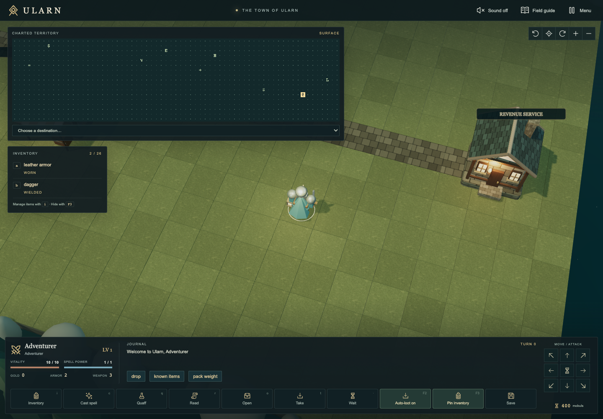
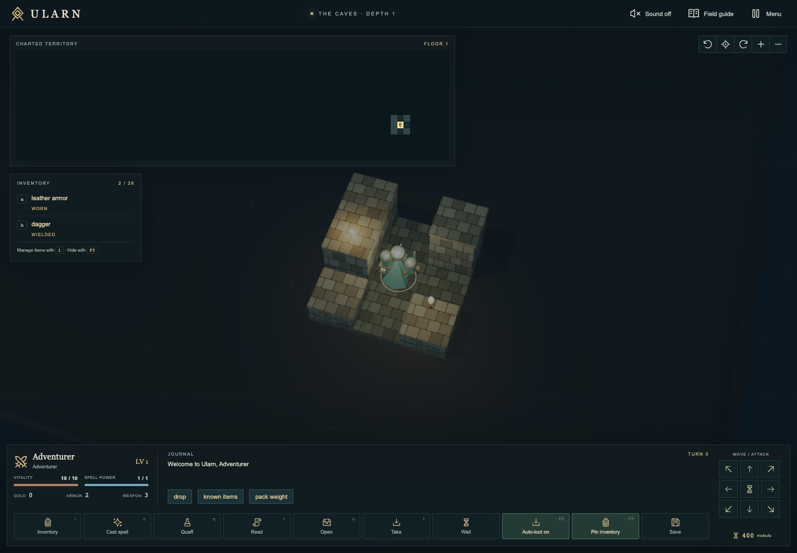

# Ularn — The Caves Below

A complete Ularn game with a Three.js presentation, playable on the web or as an offline Windows desktop app. The original JavaScript Ularn engine powers the rules; this is not a reduced recreation of its mechanics.

[Play in your browser](https://ularn-3d.vercel.app/) · [Download Windows .exe](https://ularn-3d.vercel.app/downloads/Ularn.windows.exe) · [About and controls](https://ularn-3d.vercel.app/about/)

## Gameplay screenshots

Explore the town of Ularn, visit its landmarks, and prepare for the caves below.



Descend into the dungeon and uncover its passages one turn at a time.



## Windows desktop

The [optional Windows download](https://ularn-3d.vercel.app/downloads/Ularn.windows.exe) is a self-contained portable executable: run `Ularn.windows.exe` without extracting a ZIP or installing the game. It includes the complete runtime and works offline. Browser play remains available at the same site. The executable targets 64-bit Windows 10 or later and is unsigned; its [SHA-256 checksum](https://ularn-3d.vercel.app/downloads/SHA256SUMS.txt) is published alongside it.

Desktop saves live in `%APPDATA%\Ularn`, separately from browser saves. See [desktop instructions](docs/DESKTOP.md) for profile details, alternate packages, and verification limits. Build and verify the portable executable locally with:

```sh
npm run desktop:package:win:portable
npm run desktop:verify:portable
```

These commands produce `release/Ularn.windows.exe` and `release/Ularn.windows.exe.sha256`. The verifier extracts the executable and compares its bundled runtime and game files with the build output. The pinned native NSIS toolset supports portable builds on Apple Silicon without Rosetta.

## Play locally

Requires Node.js 22.12+ (or a version supported by the pinned Vite release).

```sh
npm ci
npm run dev
```

Open the URL printed by Vite. Choose one of the eight original classes and begin an expedition. Arrow keys move and attack; the direction pad also supports diagonal moves. Click a known tile or select a town landmark to travel. Travel stops at visible danger, damage, confusion, blindness, or interaction prompts. Known traps are avoided unless selected as the destination. Drag the world to rotate the camera, scroll to zoom, and use the compass button to recenter.

- `i`: inventory; `c`: cast; `q`: drink; `r`: read; `w`: wield; `W`: wear; `d`: drop.
- `e` / Enter: enter a building; `>` / `<`: stairs; `o`: open; `t`: take; `.`: wait.
- `F2`: toggle auto-loot for items (gold is always collected); `F3`: show/hide pinned inventory. Both settings persist without consuming a turn.
- `S`: save without ending the expedition. Escape cancels a prompt or opens the menu.
- Contextual buttons retain the original engine's full interactions and shop menus.
- Press `?` for the complete original manual, or open the field guide.

The objective is to retrieve the potion of cure dianthroritis from Volcano 5 and return home in time. The Eye of Larn on Dungeon 15 reveals demons. Original combat, spells, regeneration, equipment, shops, traps, death, and victory rules are preserved.

## Graphics

The world uses a more overhead camera, locally generated textures, detailed town buildings, class-specific heroes, torch lighting, soft shadows, fog, and optional bloom. Most monsters use the engine’s bundled species sprites, animate between tiles, mirror with facing, and show a small direction marker. The 3D lemming uses an original generated natural rodent illustration in `public/art/monsters/lemming.png`; its [generation prompt](docs/art/lemming.prompt.md) is preserved. Its engine attributes and behavior, and the classic edition’s `m1u.png` sprite, remain unchanged. Monster artwork is single-view with facing mirrors, rather than eight-direction animation sheets. Floor loot uses original generated sprites in `public/art/items/` for weapons, armor, rings, the full potion and scroll tables, artifacts, gems, and gold; their [generation prompts](docs/art/items.prompt.md) are preserved. Those sprites face the camera and mirror as the view orbits, while classic `o{id}.png` tiles and engine item rules stay unchanged. Dungeon creatures pursue and attack on player turns; the world remains turn-based. Foreground walls lower near the hero.

A large symbol map stays visible without a legend. Health, mana, commands, and the journal share a compact bottom bar. Inventory can remain pinned, and timed buffs and ailments appear down the right edge. The expedition/child-cure quest card has been removed.

Stair names and messages explicitly say up or down, with different physical designs and `<` / `>` map symbols. Clicking the staircase beneath the hero sends the corresponding stair command. Stairs that intentionally lead nowhere show rubble, a cross, and a `(dead end)` label; the usable exit shaft on Volcano 1 is marked `SURFACE SHAFT`.

Fountain prompts use “wash,” and drained fountains visibly lose their water and explicitly say they are dry with no water remaining. These wording changes preserve the original draining behavior and saved fountain state.

Enable sound in the top bar for separate weapon-family sounds and distinct synthesized cues for all 39 spells. Accepted casts animate the hero and show their visible projectile path; cancelled or rejected spells do not produce casting feedback. Sounds and artwork work offline.

The interface uses 35 original SVG icons with consistent strokes and sizing, distinct class emblems, and a matching Ularn sigil and favicon. Equipment and action icons stay sharp on desktop and phone displays.

Open **Menu → Graphics** to choose Cinematic or Balanced. Balanced is the default on all devices; it reduces rendering resolution, disables bloom and the reflection environment, uses cheaper shadows and fewer dynamic lights, skips MSAA, uses display-synced frames while the camera or scene is moving, and stops drawing after the scene settles. Shared boxes, wall instances, orbs, and ground rings use low-segment geometry because the overhead camera cannot see denser meshes. Cinematic adds bloom, MSAA, image-based lighting, and a higher pixel ratio; settled title and cinematic idle scenes run at 12 FPS. Hidden windows stop rendering. The setting persists on this device. Camera gestures do not consume turns. Compact portrait and landscape layouts keep essential meters, menus, and game controls reachable. Enter or Space activates a focused interface button. The title scene batches building geometry by material. Reduced-motion preferences are respected. If the browser loses its graphics context, gameplay input pauses, a save is attempted, and rendering recovers when the context returns.

## Saves

A compressed, versioned autosave is stored locally after completed turns. Changes are coalesced over two seconds to avoid recompressing every explored floor on each keystroke; manual saves and page exit save immediately. Continue restores position, generated maps, monsters, inventory, stats, and game time. New saves preserve exact equipped inventory slots even when items are identical, and resumed games preserve the selected difficulty for newly generated monsters. Menus and unfinished prompts do not replace the last stable save. Storage failures display an explicit message. Resume validates saved map dimensions and player state before loading. Legacy checkpoint, backup, and end-of-run save slots use a separate 3D namespace, preserving classic saves during play as well as on reload. Death or victory deletes the resumable expedition. Beginning another expedition replaces the current autosave. Saves belong to the exact web origin and device; preview and production domains have separate saves.

No account, database, API key, remotely hosted assets, analytics, or score server is required by the 3D edition. Scores remain local. Global leaderboards, live broadcasts, weekly challenges, and remote replays from larn.org are intentionally not connected.

## Build and Vercel

```sh
npm run build
npm run preview
```

`dist/` is a standalone static website, containing HTML, JavaScript, CSS, and local assets. Serve over HTTP/HTTPS; ES modules cannot be opened directly via `file://`. The game lives at `/`; `/about/` serves a static guide with controls, gameplay information, and links to browser play and the Windows download. Both pages have canonical URLs, descriptions, social cards, and JSON-LD. `public/robots.txt` advertises the sitemap, and `public/sitemap.xml` lists these two public pages. Social previews use `public/social/ularn.png`.

`vercel.json` specifies Vite, `npm run build`, and the `dist` output directory. It normalizes the guide URL, marks engine/download URLs as non-indexable, and serves the executable as an attachment with cache revalidation. No application environment variables or server functions are needed.

The Windows executable is deliberately excluded from Git. A source-only Git deployment therefore cannot embed it. Production keeps the stable `/downloads/Ularn.windows.exe` URL and redirects it to the GitHub Release asset `Ularn-${version}.windows.exe` for the current `package.json` version. A push to `main` runs the Windows desktop workflow, which publishes that release after verifying the portable build.

Optional local prebuilt deploys can still stage a verified executable under `public/downloads/` before building:

```sh
npm ci
npm run desktop:package:win:portable
npm run desktop:verify:portable
mkdir -p public/downloads
cp release/Ularn.windows.exe public/downloads/Ularn.windows.exe
cp release/Ularn.windows.exe.sha256 public/downloads/SHA256SUMS.txt
npx vercel pull --yes --environment=production --scope hellos-projects-dbb58047
npx vercel build --prod --scope hellos-projects-dbb58047
cmp release/Ularn.windows.exe .vercel/output/static/downloads/Ularn.windows.exe
cmp public/downloads/SHA256SUMS.txt .vercel/output/static/downloads/SHA256SUMS.txt
```

After both comparisons succeed, publish that prebuilt output:

```sh
npx vercel deploy --prebuilt --prod --scope hellos-projects-dbb58047
```

Vercel's local build writes `.vercel/output`, and `--prebuilt` uploads that verified output. See the [Vercel build documentation](https://vercel.com/docs/cli/build). `release/` is excluded from Vercel uploads. Git-connected production deploys rely on the GitHub Release redirect rather than a staged binary. Desktop packaging excludes `dist/downloads/`, preventing the executable from recursively bundling itself.

A classic 2D fallback is available at `/engine/larn_local.html?ularn=true` for devices without WebGL2. Its saves use the original engine's storage keys, separate from the 3D edition's autosave.

## Verification

```sh
npm test
```

Start the dev server first. `TEST_URL` can select another server. `CHROME_PATH` can point to an installed Chromium executable; by default the tests use Chrome on macOS. Tests use isolated browser profiles and never access your normal browser data.

Tests cover character creation, movement, inventory, save/load, dungeon entry, collision, combat, rendering visibility rules, stores, spells, potions, all depth generation, death, local-only requests, mobile controls, all classes, corrupted saves, and the cure/victory sequence. Additional regression checks cover travel hazards, storage exhaustion, classic save isolation, touch gestures, building selection, both graphics settings, WebGL context recovery, mobile shops, GPU resource reuse across levels, cancellation of native auto-explore on pause, checkpoint/winner save isolation, complete multi-floor restoration, and real shop/bank transactions. Combat and late-game scenarios seed deterministic fixtures; these are integration checks, not a claim that every random playthrough has been exhausted.

## Attribution

Original Ularn by Phil Cordier, descended from Noah Morgan's Larn. This project vendors Jason Primeau's JavaScript Larn/Ularn 12.5.4, build 613, from <https://github.com/primeau/Larn> (retrieved September 16, 2026). Its MIT license is preserved at `public/engine/LICENSE`. Vendor library notices remain in their original files. Three.js is MIT-licensed.

See [ARCHITECTURE.md](ARCHITECTURE.md) for the engine/presentation boundary.
