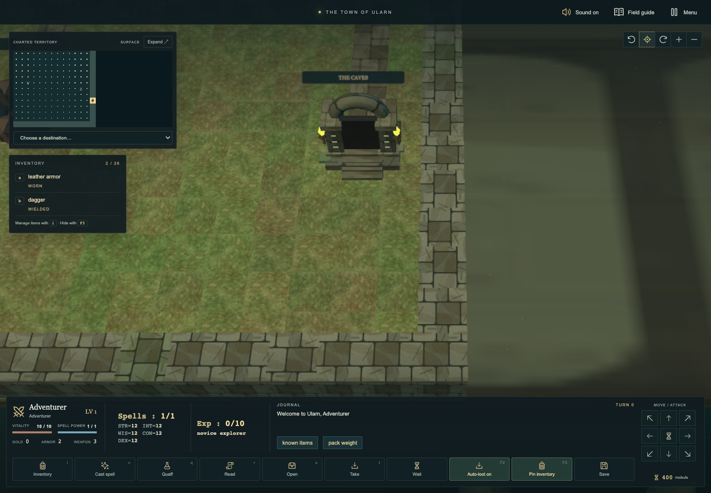
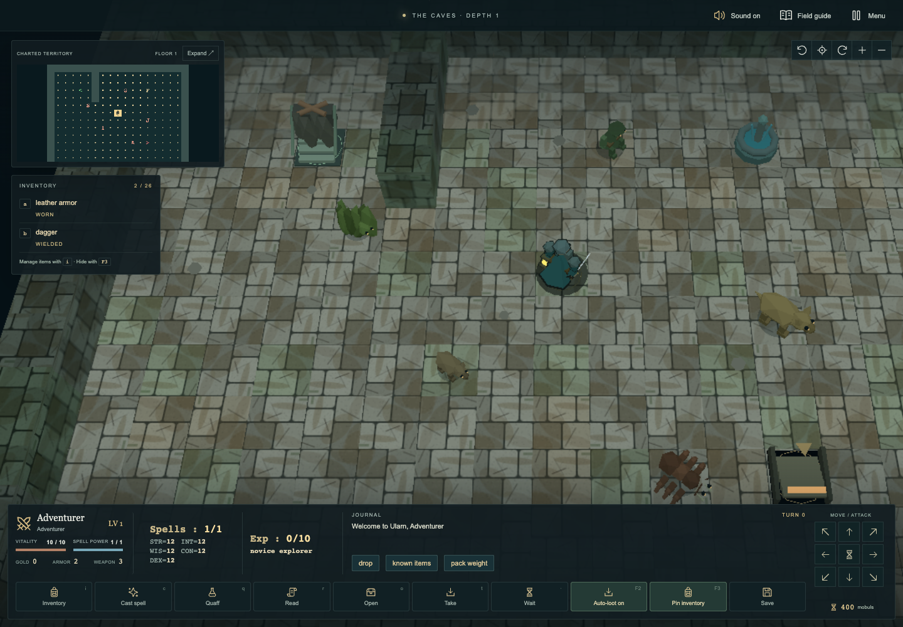

# Ularn — The Caves Below

A complete Ularn game with a Three.js presentation, playable on the web or as an offline Windows desktop app. The original JavaScript Ularn engine powers the rules; this is not a reduced recreation of its mechanics.

[Home](https://ularn-3d.vercel.app/) · [Play in your browser](https://ularn-3d.vercel.app/play/) · [Download Windows .exe](https://ularn-3d.vercel.app/downloads/Ularn.windows.exe) · [About](https://ularn-3d.vercel.app/about/) · [What’s New](https://ularn-3d.vercel.app/changelog/) · [History & creators](https://ularn-3d.vercel.app/about/#history) · [GitHub](https://github.com/helloivanco/ularn3d)

## Gameplay screenshots

Explore the town of Ularn, visit its landmarks, and prepare for the caves below.



Descend into the dungeon and uncover its passages one turn at a time.



## Windows desktop

The [optional Windows download](https://ularn-3d.vercel.app/downloads/Ularn.windows.exe) is a self-contained portable executable: run the versioned `Ularn-<version>.windows.exe` without extracting a ZIP or installing the game. It includes the complete runtime and works offline. Browser play remains available at the same site. The executable targets 64-bit Windows 10 or later and is unsigned; its [SHA-256 checksum](https://ularn-3d.vercel.app/downloads/SHA256SUMS.txt) is published alongside it.

Desktop saves live in `%APPDATA%\Ularn`, separately from browser saves. See [desktop instructions](docs/DESKTOP.md) for profile details, alternate packages, and verification limits. Build and verify the portable executable locally with:

```sh
npm run desktop:package:win:portable
npm run desktop:verify:portable
```

These commands produce `release/Ularn-<version>.windows.exe` and its matching `.sha256` file. The verifier extracts the executable and compares its bundled runtime and game files with the build output. The pinned native NSIS toolset supports portable builds on Apple Silicon without Rosetta.

## Play locally

Requires Node.js 22.12+ (or a version supported by the pinned Vite release).

```sh
npm ci
npm run dev
```

Open `/play/` at the URL printed by Vite. Choose one of the eight original classes and begin an expedition. Arrow keys move and attack; the direction pad also supports diagonal moves. Hold a direction to repeat after 220 ms, then every 140 ms. Releasing it, opening a menu, losing focus, or entering a prompt stops repetition. Click a known tile or select a town landmark to travel. Travel stops at visible hostile creatures, damage, confusion, blindness, or interaction prompts. Harmless lemmings do not interrupt routes; stepping into one clears it and advances in the same turn, so holding a direction keeps its normal cadence. Known traps are avoided unless selected as the destination. The compact map follows your position. Use **Expand** for the full explored floor, drag that map to pan, and use its zoom buttons or scroll wheel to inspect routes. Opening the map stops travel; selecting a known tile closes it and starts a new route. Drag the world to rotate the camera, scroll to zoom, and use the compass button to recenter.

- `i`: inventory; `c`: cast; `q`: drink; `r`: read; `w`: wield; `W`: wear; `d`: drop.
- `e` / Enter: enter a building; `>` / `<`: stairs; `o`: open; `t`: take; `.`: wait.
- `F2`: toggle auto-loot for items (gold is always collected); `F3`: show/hide pinned inventory. Both settings persist without consuming a turn.
- `S`: save without ending the expedition. Escape cancels a prompt or opens the menu.
- Contextual buttons retain the original engine's full interactions and shop menus.
- Press `?` for the complete original manual, or open the field guide.

The objective is to retrieve the potion of cure dianthroritis from Volcano 5 and return home in time. The Eye of Larn on Dungeon 15 reveals demons. Original combat, spells, regeneration, equipment, shops, traps, death, and victory rules are preserved except for a lemming balance adjustment in solo 3D play: new lemmings are capped at four per floor, no longer reproduce when moving or attacked, and die in one melee attack. New cave floors include rodents, and cleared caves regain occasional random arrivals as you explore. These arrivals stay away from the hero and avoid occupied tiles, loot, doors, stairs and traps; they respect time stop and genocide. A directional attack on a lemming also advances into the cleared tile in that same turn. Lemmings do not block automatic routes or interrupt running, resting or nearby interactions; other creatures retain those checks. Existing saved swarms remain intact and can be cleared with the new behavior; the classic edition retains its original rules.

## Graphics

The world uses an overhead camera, locally generated cached color maps with normal and roughness detail, detailed town buildings, class-specific heroes, torch lighting, soft shadows, fog, and optional bloom and ambient occlusion. All 66 Ularn creatures, including the loot goblin, have species-specific stylized 3D models using shared family rigs, distinct details and proportions, smooth facing, and walking, breathing, wing and tail motion. All eight heroes have distinct clothing, faces, proportions and class details, and wielded weapon families appear in their hands. Swords have tapered, faceted blades, fullers, wrapped grips, guards and jewel-set pommels; the dagger retains its thin overhead edge with faceting and small grip details; the six sword types have distinct proportions and finishes. Sword attacks coordinate the arm and torso through wind-up, strike and recovery, with a short blade trail and confirmed-hit sparks. Fast attacks retarget the displayed pose, damage remains immediate, and reduced motion disables the swing and trail. Creature identities and turn-based gameplay remain intact; the lemming balance adjustment above applies only to solo 3D play. The earlier lemming illustration and its [generation prompt](docs/art/lemming.prompt.md) remain as reference artwork; the classic edition retains its original sprites.

Floor loot retains the generated item artwork, pale-card alpha removal, identified-item variants and hover details from the current GitHub game. Floor loot uses original generated sprites in `public/art/items/` for weapons, armor, rings, the full potion and scroll tables, artifacts, gems, and gold; their [generation prompts](docs/art/items.prompt.md) are preserved. Those sprites face the camera and mirror as the view orbits, while classic `o{id}.png` tiles and engine item rules stay unchanged.
Rendering reduces flicker with separated wall caps, smoother cutaways, stable shadow texels, gentle torch variation and lamp fades. Cinematic adds SMAA edge smoothing, and damage briefly highlights health without tinting the whole scene.

The compact symbol map stays visible without a legend and expands for full-floor planning. Click travel plans a safe explored route without drawing guidance lines or destination markers on the world or maps. Health, mana, commands, and the journal share a compact bottom bar. Inventory can remain pinned, and timed buffs and ailments appear down the right edge. The camera frames the hero in the open gameplay area. Nearby foreground walls lower, and buildings fade when they conceal the hero.

Stair names and messages explicitly say up or down, with different physical designs and `<` / `>` map symbols. Clicking the staircase beneath the hero sends the corresponding stair command. Stairs that intentionally lead nowhere show rubble, a cross, and a `(dead end)` label; the usable exit shaft on Volcano 1 is marked `SURFACE SHAFT`.

Fountain prompts use “wash,” and drained fountains visibly lose their water and explicitly say they are dry with no water remaining. These wording changes preserve the original draining behavior and saved fountain state.

Music and effects start on **Play** or **Continue** after the browser accepts that gesture. The top-bar Sound button mutes everything; **Menu → Sound & music** offers independent music/effect volumes. Your mute and volume choices persist. An original instrumental fantasy score gives the title, town, caves, and volcano separate arrangements; a synchronized percussion layer follows visible danger and accepted combat. Region changes crossfade, menus soften the music, and hidden windows stop all sources and resume music without replaying old effects. Weapon families, all 39 spells, grass/stone/ash footsteps, actual door/chest opening, potion use, reading, loot, coins, stairs, death, and victory have distinct cues. Cancelled or rejected actions stay quiet. Music, effects, and artwork work offline; no external soundfonts or music services are used. See [audio design and verification](docs/AUDIO.md) and [hear the score preview](docs/audio/soundtrack-preview.wav).

The interface uses 35 original SVG icons with consistent strokes and sizing, distinct class emblems, and a matching Ularn sigil and favicon. Equipment and action icons stay sharp on desktop and phone displays.

Open **Menu → Graphics** to choose **Auto**, **Balanced**, or **Cinematic**. Auto is the default and targets 60 FPS, adjusting rendering resolution after sustained overload or headroom. Its high tier sharpens up to native resolution while keeping shadows and postprocessing off. Existing Balanced and Cinematic preferences are preserved. Balanced uses lighter rendering without postprocessing; Cinematic adds bloom and ambient occlusion. Both target 60 FPS while active. Auto and Balanced stop drawing settled gameplay scenes; Cinematic idles at 12 FPS. Hidden windows stop rendering. Camera gestures do not consume turns. Compact portrait and landscape layouts keep essential meters, menus, and controls reachable. Enter or Space activates a focused interface button. Reduced-motion preferences are respected. Context loss pauses gameplay input, attempts a save, and recovers when graphics return.

Known terrain is instanced in spatial chunks. Repeated scenery, torches and items are merged by compatible material with vertex colors, and unchanged terrain is reused between turns. Aligned stone/grass/wood/roof maps, baked wall shading and feathered ground contact add depth without extra triangles or rendering passes. Map, inventory, effect and journal updates avoid unchanged content. Hover picking happens at most once per rendered frame. The hero takes a 140 ms collision-aware step with restrained body sway, bending knees/ankles and a steadier weapon arm. Footsteps follow the landing, with quiet dry grass, stone and ash textures. Rapid steps blend from the displayed pose; weapon actions retain their retargetable motion and trail. Creatures settle in approximately 100 ms. The engine processes actions immediately, and rapid movement retargets the displayed position. See [graphics verification](docs/GRAPHICS.md) for diagnostics and benchmarking.

## Saves

A compressed, versioned autosave is stored locally after completed turns. Changes are coalesced over two seconds, captured as immutable stable state, and compressed in a local worker. Periodic checkpoints use the same worker queue. Newer captures, manual saves, death and victory supersede stale worker results. Worker failures fall back to compression at an idle opportunity. Manual saves and page exit save synchronously and immediately. Continue restores position, generated maps, monsters, inventory, stats, and game time. New saves preserve exact equipped inventory slots even when items are identical, and resumed games preserve the selected difficulty for newly generated monsters. Menus and unfinished prompts do not replace the last stable save. Storage failures display an explicit message. Resume validates saved map dimensions and player state before loading. Legacy checkpoint, backup, and end-of-run save slots use a separate 3D namespace, preserving classic saves during play as well as on reload. Death or victory deletes the resumable expedition. Beginning another expedition replaces the current autosave. Saves belong to the exact web origin and device; preview and production domains have separate saves.

Solo play works offline without an account. Completed eligible scores also sync automatically to the public expedition board when online; failed uploads remain queued locally. Online room results use the separate verified leaderboard.

## Online play

Multiplayer in the browser supports 2–4 adventurers plus spectators. Choose **Multiplayer → Host a room**, select your calling, and copy the invite link. Each player selects **Ready to play**, then the host selects **Start expedition**. Every player controls their own character, inventory, and explored map. Late joiners start a fresh adventurer in town and catch up to the shared expedition.

The **Room** button shows the code and members, with host controls to remove a member or transfer hosting. **Leave room** is always available in the lobby and the top bar during play, including for spectators. It shows exit progress and returns to the welcome screen even if the connection fails; an active teammate inherits hosting. Leaving clears automatic reconnection, while reloading during play restores the room. A disconnected place is held for two minutes. Spectators can follow living players and chat without sending gameplay commands. Room progress syncs through a server-ordered action log and does not overwrite a solo save.

Chat has role-appropriate channels, **Quick send** presets, delivery/error feedback, and a minimized unread counter. Presets send once and preserve any typed draft. Player input, room starts, membership changes, and chat are checked on the server; browsers do not trust peer broadcasts. Online score verification uses the recorded server log and character configuration, within the existing verifier's 1,200-action/CPU limits.

Online rooms, chat, and the verified leaderboard are optional. The game loads the Supabase client only after you open Multiplayer, Watch, Chat, or Leaderboard, or after a finished run is submitted. If those values are missing or the service cannot be reached, those menus say “Online unavailable” and solo play is unchanged.

Copy `.env.example` to `.env` before `npm run dev` or `npm run build`:

```sh
VITE_SUPABASE_URL=https://rysazeizsuefshazbwyh.supabase.co
VITE_SUPABASE_PUBLISHABLE_KEY=sb_publishable_keXMN2GiqTPVZ9WlRtIYkw_AmndgmgW
```

The publishable key is the only client key. Never put a service-role or secret key in `.env`, the repo, or the Electron package. `npm run build` bakes `VITE_SUPABASE_URL` and `VITE_SUPABASE_PUBLISHABLE_KEY` into the renderer, and the desktop scripts run that build, so a packaged game uses the same values. Sign-in is anonymous. Display names are 3–16 characters and are rejected when they contain a blocked word.

Turnstile CAPTCHA for anonymous sign-in is off unless `VITE_SUPABASE_CAPTCHA=true` and `VITE_TURNSTILE_SITE_KEY` are set, and CAPTCHA is enabled in the Supabase Auth dashboard. Leave both unset for local play.

The public leaderboard shows only rows the `submit-score` Edge Function has marked verified. The function reads `SUPABASE_SERVICE_ROLE_KEY` from Supabase function secrets, replays the finished log in a headless engine, and inserts that score. The game does not send the score. A log that is too long for the free-plan CPU budget is rejected as `replay_cpu_cap` and stays off the board. Shorter runs still verify.

## Expedition records

No account is required to play or save. **Menu → Scoreboard** (or `z`) reads this edition's global scores from the **Games → ularn3d** Supabase project, in `public.ularn_scores`. Eligible completed expeditions save locally and upload automatically. Offline or failed uploads remain in a durable queue and retry when online, on reload, and with bounded backoff; repeated uploads cannot replace an existing result. Use **Local records** for this device's records. Score details open beneath the board, and the next-page button cycles through winners and visitors. Failed global reads fall back locally after an eight-second request timeout. Desktop also supports score reads and uploads. The 3D and classic editions have separate boards. Debug runs stay local. This fork does not use larn.org's score server, broadcasts, weekly challenges, or remote replays. See [score storage and verification](docs/SCORES.md).

Solo and classic expedition records use the append-only table. Online rooms retain their existing authenticated, replay-verified `runs`/`scores` pipeline and leaderboard. This preserves the current room, chat, spectator, and host-migration features.

## Build and Vercel

```sh
npm run build
npm run preview
```

`dist/` is a standalone static website, containing HTML, JavaScript, CSS, and local assets. Serve over HTTP/HTTPS; ES modules cannot be opened directly via `file://`. The marketing home lives at `/`; browser play is at `/play/`; `/about/` is the field guide and also hosts Larn / Ultra-Larn history (`/about/#history`); `/changelog/` is What’s New (curated from root `CHANGELOG.md`, with [GitHub Releases](https://github.com/helloivanco/ularn3d/releases) for full history). These pages have canonical URLs, descriptions, social cards, and JSON-LD. `public/robots.txt` advertises the sitemap, and `public/sitemap.xml` lists the public pages. Social previews use `public/social/ularn.png`.

The home page presents the quest over a lightweight town preview, with Play as its primary action and Windows as an optional download. The background does not capture page gestures and stops rendering off-screen or while hidden. Marketing content is visible without JavaScript. The play entry centers its setup column vertically within a safe area below the navigation, keeping the controls left-aligned and allowing inner scrolling on short windows. It shows the eight actual class models as small cached WebP portraits, with name/difficulty controls and a separate multiplayer action. Continue is the primary action when a saved expedition exists. Repeated introductory and scene-caption text is omitted. `node scripts/render-class-portraits.mjs` regenerates the portraits from the shared models against the development server; no extra WebGL scenes run in the class chooser. Entry styling is isolated in `src/entry.css`, leaving expedition controls intact.

`vercel.json` specifies Vite, `npm run build`, and the `dist` output directory. It normalizes the guide URL, marks engine/download URLs as non-indexable, and serves the executable as an attachment with cache revalidation. A small download resolver selects the last fully published Windows release and lets its versioned asset supply the saved filename. `scoreboard.config.json` contains the public Supabase project URL and publishable key; optional `VITE_SUPABASE_URL` and `VITE_SUPABASE_PUBLISHABLE_KEY` overrides select another project. These are public client settings, not server credentials.

The Windows executable is deliberately excluded from Git. A source-only Git deployment therefore cannot embed it. Production keeps the stable `/downloads/Ularn.windows.exe` URL. Its resolver selects `Ularn-${version}.windows.exe` from the last fully published GitHub Release, so downloading an older ready desktop build preserves that build’s actual version in the filename. A push to `main` runs the Windows desktop workflow, which publishes that release after verifying the portable build.

Git-connected production deploys use the download resolver and GitHub Release assets. Desktop packaging excludes `dist/downloads/`, preventing the executable from recursively bundling itself.

A classic 2D fallback is available at `/engine/larn_local.html?ularn=true` for devices without WebGL2. Its saves use the original engine's storage keys, separate from the 3D edition's autosave.

## Verification

```sh
npm test
```

Start the dev server first. `TEST_URL` can select another server. `CHROME_PATH` can point to an installed Chromium executable; by default the tests use Chrome on macOS. Tests use isolated browser profiles and never access your normal browser data. The default functional configuration uses SwiftShader; set `TEST_GPU=hardware` for hardware-accelerated regressions. Use `node scripts/benchmark.mjs` to measure actual GPU frame pacing separately.

Tests cover character creation, movement, inventory, save/load, dungeon entry, collision, combat, rendering visibility rules, stores, spells, potions, all depth generation, death, local-only requests, mobile controls, all classes, corrupted saves, and the cure/victory sequence. Additional regression checks cover travel hazards, storage exhaustion, classic save isolation, touch gestures, building selection, both graphics settings, WebGL context recovery, mobile shops, GPU resource reuse across levels, cancellation of native auto-explore on pause, checkpoint/winner save isolation, complete multi-floor restoration, and real shop/bank transactions. Combat and late-game scenarios seed deterministic fixtures; these are integration checks, not a claim that every random playthrough has been exhausted.

## Attribution

Original Ularn by Phil Cordier, descended from Noah Morgan's Larn. This project vendors Jason Primeau's JavaScript Larn/Ularn 12.5.4, build 613, from <https://github.com/primeau/Larn> (retrieved September 16, 2026). Its MIT license is preserved at `public/engine/LICENSE`. Vendor library notices remain in their original files. Three.js is MIT-licensed.

See [ARCHITECTURE.md](ARCHITECTURE.md) for the engine/presentation boundary.

Seeded deterministic replay sessions retain the native rules and RNG stream; local solo lemming adapters apply only to ordinary unseeded 3D expeditions.
