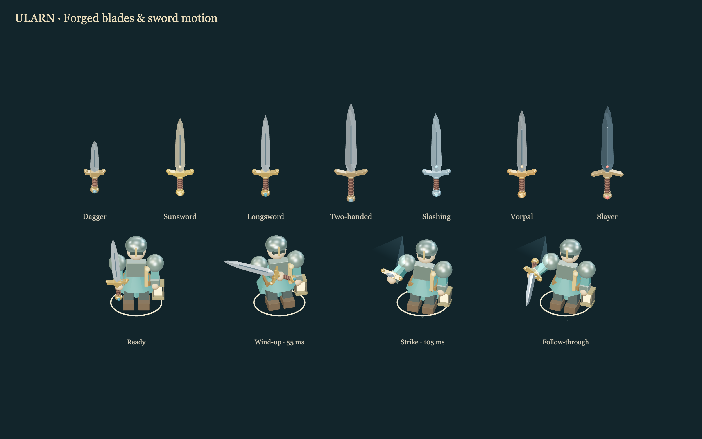

# Blades and sword action

The dagger and six sword types now use locally authored, cached procedural models. Each has a tapered diamond-section blade, a visible fuller, swept guard, wrapped leather grip and a faceted pommel. Sunsword, two-handed sword, longsword, sword of slashing, Vorpal Blade and Slayer have distinct proportions, metal finishes and accents. Held weapons and floor loot use the same models; switching sword IDs updates the model immediately.

All eight heroes have an articulated right arm with the weapon attached to the hand. A resolved attack starts a 55 ms wind-up, reaches contact at 105 ms, follows through, and settles exactly at the resting pose after 330 ms. Closely spaced attacks alternate slash direction and begin from the currently displayed pose. There is one active action and no animation queue. Turns and damage remain immediate.

A fixed eight-sample ribbon follows the actual blade through the strike. Ten pooled spark points briefly mark confirmed hits on visible targets. Misses retain the swing and swish without showing impact sparks. Audio contact occurs at the same 105 ms point. Waiting beside a creature does not start an attack. Accepted spells use a raised-arm gesture.

Pause, hidden windows, graphics loss, equipment changes, endings and floor changes clear the pose and effects. Reduced motion skips weapon animation and transient feedback. Shared weapon geometry/materials and reusable effect buffers keep repeated attacks and equipment changes bounded. No new online assets or dependencies are needed.

`ularnGraphics.metrics()` reports weapon identity, attack phase/sequence, arm and weapon angles, trail count and confirmed impact count. `tests/sword-action.spec.js` checks blade bounds and shared geometry, exact settling, retargeting, visibility, misses, reduced motion, sound timing, immediate damage, waiting, pause and resource reuse.

`node scripts/visual-swords.mjs` regenerates the gallery plus desktop/Retina and mobile gameplay captures against the local development server.

## Recorded verification

Browser checks cover combat, all eight classes, movement, spells, audio, equipment/save restoration, visibility, Retina graphics recovery and exact animation settling. All six sword checks also pass against the production preview with software rendering. The production build and offline desktop smoke pass.

At 1440 × 1000 in Auto on an Apple M2 Pro, navigation recorded 60.1 FPS with a 17.5 ms frame p95. Twenty-four repeated longsword attacks recorded 59.9 FPS, 17.7 ms frame p95 and 17.4 ms input-to-render p95, with 24 confirmed impacts and at most eight trail samples. The revealed-floor fixture hash matches the original graphics benchmark; average draw calls are 125 versus the original 322. [Raw measurements](sword-benchmark.json).
